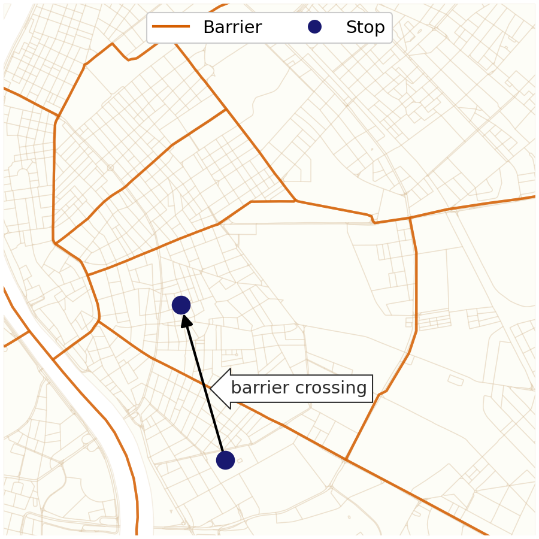
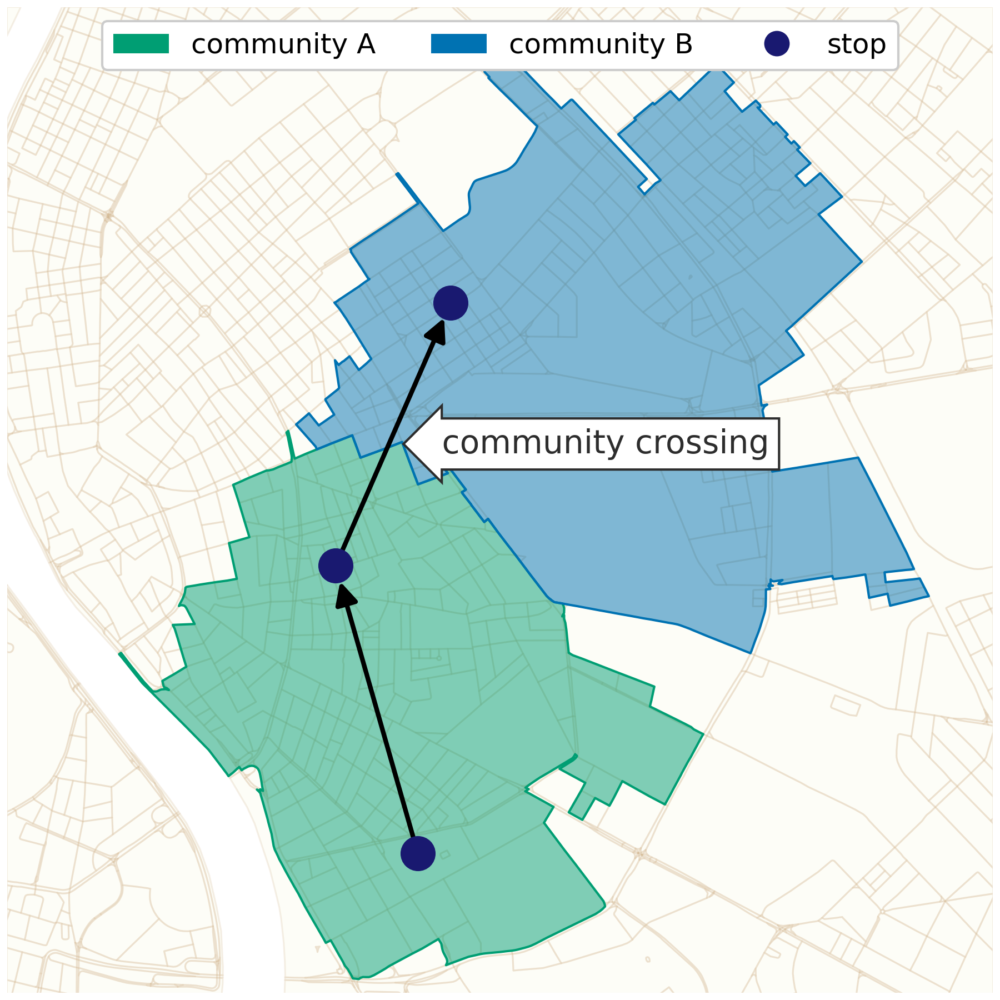

# code for Quantifying Barriers of Urban Mobility

This repository contains scripts to reproduce the results of the research paper: Quantifying Barriers of Urban Mobility


## input data

As described in the paper the raw mobile positioning data cannot be shared, but the networks constructed from the mobility is available.
The CSVs are edgelists, which connects places in Budapest, hence the filenames, 'place connections'. The second part of the filename is the date interval and there is an optional _variant identifier_.

The public input files for
- the pre-pandemic interval: `data/place_connections_2019-09-01_2020-02-29.csv`
- the COVID-19 interval: `data/place_connections_2020-11-01_2021-04-31.csv`
- the Liberty Bride case study
    - 1-2 June 2019: `data/place_connections_2019-06-01_2019-06-02.csv`
    - 8-9 June 2019: `data/place_connections_2019-06-08_2019-06-09.csv`
    - 15-16 June 2019: `data/place_connections_2019-06-15_2019-06-16.csv`
    - 22-23 June 2019: `data/place_connections_2019-06-22_2019-06-23.csv`
    - 29-30 June 2019: `data/place_connections_2019-06-29_2019-06-30.csv`
    - 6-7 July 2019: `data/place_connections_2019-07-06_2019-07-07.csv`
    - 13-14 July 2019: `data/place_connections_2019-07-13_2019-07-14.csv`
    - 20-21 July 2019: `data/place_connections_2019-07-20_2019-07-21.csv`
    - 27-28 July 2019: `data/place_connections_2019-07-27_2019-07-28.csv`
- Budapest district groups vs. agglomeration sector setting
    - the seven district group of Budapest
        - `place_connections_2019-09-01_2020-02-29_eastern_pest_inner.csv`
        - `place_connections_2019-09-01_2020-02-29_eastern_pest_outer.csv`
        - `place_connections_2019-09-01_2020-02-29_inner_pest.csv`
        - `place_connections_2019-09-01_2020-02-29_north_buda.csv`
        - `place_connections_2019-09-01_2020-02-29_north_pest.csv`
        - `place_connections_2019-09-01_2020-02-29_south_buda.csv`
        - `place_connections_2019-09-01_2020-02-29_south_pest.csv`
    - the six sectors of the agglomeration
        - `place_connections_2019-09-01_2020-02-29_northern_sector.csv`
        - `place_connections_2019-09-01_2020-02-29_eastern_sector.csv`
        - `place_connections_2019-09-01_2020-02-29_south_eastern_sector.csv`
        - `place_connections_2019-09-01_2020-02-29_southern_sector.csv`
        - `place_connections_2019-09-01_2020-02-29_western_sector.csv`
        - `place_connections_2019-09-01_2020-02-29_north_western_sector.csv`

> [!IMPORTANT]
> each of the Liberty Bridge file have a downtown variant


### edgelist schema

- **device_id**: integer
- **day**: date in YYYY-MM-DD format
- **source**: block ID (integer) in the [house_blocks.geojson](data/house_blocks.geojson)
- **target**: block ID (integer) in the [house_blocks.geojson](data/house_blocks.geojson)
- **weight**: integer, edge weight describing how many times a device moved between block A and B in a day
- **distance**: integer (in kilometers), the euclidean distance between the centroid of the source and target block
    - practically unused


### geographic data

The geographic data is extracted from OpenStreetMap.

- administrative
    - [Budapest administrative boundary](data/budapest.geojson)
    - [the districts of Budapest](data/budapest_districts.geojson)
    - [the neighborhoods of Budapest](data/admin10.geojson)
        - admin level 10 in OSM
    - [settlements of the agglomeration](data/cities.geojson)
- natural
    - [river Danube](data/duna.geojson)
    - [river Danube as LineString](data/duna_linestring.geojson)
- infrastructure
- miscellaneous
    - [handdrawn shapefile of Budapest downtown](data/downtown.geojson)
        - used for the Liberty Bridge case study
    - [dictionary that associates the settlements to the sectors of the agglomeration](data/sector_settlements.yaml)
        - defined by the Hungarian Central Statistical Office


### blocks


### barriers


## workflow

### 1. Detect communities

```
poetry run python src/place_network_louvain.py --observed-network data/#{input} --block data/house_blocks.geojson --community-dir place_communities/#{network}
```


### 2. Generate beeline trips

After observed, run with seed (`-seed`) values from 0 to 9.
For the two main networks (pre-pandemic and pandemic) the community detection is issued 10 times with seed values 0-9.

```
poetry run python src/generate_beeline_trips.py --observed observed --blocks data/house_blocks.geojson --network-dir output/network/
poetry run python src/generate_beeline_trips.py --observed observed --seed 0 --blocks data/house_blocks.geojson --network-dir output/network/
```

### 3. Calculate barrier crossings

Run also for all the random networks (`--network`) values from seed0_0 to seed9_9.

```
python src/calculate_barrier_crossings.py --network observed --multithreading --roads output/roads/ --river data/duna_linestring.geojson --admin-data data
```


### 4. convert to NetworkX edgelist

The 'place connection' CSVs are practically edgelists, but still contains additional information about the edges. Some scripts are designed to work exclusively with [NetworkX](https://networkx.org/) edgelists. The purpose of this script is to make the conversion.

```
poetry run python src/convert_to_edgelist.py --input data/<INPUT> --output output/network/ --suffix <SUFFIX>
```

where `<INPUT>` is a place connection CSV and `<SUFFIX>` is an optional _variant identifier_.

### 5. generate beeline trips

As in the original, raw data there are no complete trajectories, the route between the origin and destination is assumed as a straight line.

In this step the straight lines are generated as geometries (LineStrings) between the centroid of the source and target blocks.

```
poetry run python src/generate_beeline_trips.py --observed observed_<INPUT> --blocks data/house_blocks.geojson --network-dir output/network/
```

where `<INPUT>` is a NetworkX edgelist without extension. Note that it is also gzipped (.edgelist.gz), but the previous step takes care of the compression.
In other words, the INPUT is actually the 'name' of the network.


### 6. calculate barrier crossings

In this step the barrier crossing are calculated, if a trip (as a LineString) intersects a barrier geometry, then that is counted as a crossing.



```
poetry run python src/calculate_barrier_crossings.py --network observed_<INPUT> --multithreading --pool 2
```

where the `<INPUT>` is the 'name' of the network, as before.

The `--pool` argument can be used to increase the parallelism in the processing, but note that it will increase the RAM usage as well.


### calculate community crossings

Similar to the previous step, but calculates the community border crossings.



```
poetry run python src/calculate_community_crossings.py --network observed_<INPUT> --communities output/place_communities/<INPUT>/louvain --run-stop 10
```

where the `<INPUT>` is the 'name' of the network, as before.

For the `--run-stop` argument set how many times the Louvain community detection was executed. The script will calculate the community crossings for each execution.
Do not change it unless you know what you are doing.


### 7. calculating the Barrier Crossing Ratio

In this step, the Barrier Crossing Ratio (BCR) is calculated, using the output of the previous two steps. BCR is defined as follows.

$$ BCR_\gamma = \dfrac{1}{n}\frac{\sum_{m} \text{{CB}}(M_k^i, U)}{\sum_{m} \left(\text{{CB}}(M_k^i, U) \times \text{{CC}}(M_k^i, C_{\gamma})\right)} $$

where $m$ is the total number of mobility edges, $CB$ is a binary function that evaluates to 1 if $M_k^i$, the $k^{th}$ mobility edge from block $i$, crosses an urban barrier $U$ and 0 otherwise, while the function $CC$ takes the value of 1 if $M_k^i$ crosses mobility clusters and $n$ is the number of Louvain iterations at resolution $\gamma$.

```
poetry run python src/null_model_obs_ratio.py --barrier-crossing output/barrier_crossing/observed_<INPUT> --community-crossing output/community_crossing/observed_<INPUT> --output output/obs_ratio/<INPUT>
```

where the `<INPUT>` is the 'name' of the network, as before.

> [!IMPORTANT]
> The Barrier Crossing Ration (BCR) output files are tracked in this repository to provide them without the requirement of executing the whole data processing pipeline.


### pipelines

To aid and (partially) automatize the comutation workflow some 'pipeline' script were developed.

Three of them is (currently) written in Ruby (requires at least 3.0), the fourth one is in Python (can work within the predefined environment, see the details below).

- pipeline.rb: can be used to process a network
- pipeline_libertybridge.rb: specifically developed to process the networks for Liberty Bridge case study
- pipeline_weekday_weekend.rb: specifically developed to process the networks for workday-holiday comparison networks
- pipeline_group.py: specifically developed to process the networks for district group vs. agglomeration comparisions


<!--## Citation-->


## requirements

The project is managed by [Poetry](https://python-poetry.org/), the dependencies are listed in [`pyproject.toml`](pyproject.toml).
To install dependencies and set up virtual environment, use the command `poetry lock && poetry install`.

> [!WARNING]
> Executing the scripts describe above will create partial result files of tens of gigabytes.
> This is because of the multiple execution of the Louvain community detection.
> Even with using the pipeline script, calculating everything will take several hours.

> [!WARNING]
> Although precise hardware resource requirements are not provided, please note that most of the data processing can be done using a laptop with an 11th Gen Intel® Core™ i5-1135G7 processor and 40 GB of RAM available.
> The only exception is the OLS calculation which requires much more RAM as the current implementation (gravity.jl) keeps every model in memory until the result table is generated.

## license

- The code is licensed under [BSD-2-Clause](LICENSE)
- The documentation and figures are [CC BY 4.0](https://creativecommons.org/licenses/by/4.0/)
- The shape files are from OpenStreetMap and licensed under the Open Data Commons Open Database License ([ODbL](https://opendatacommons.org/licenses/odbl/1-0/))


<details>
<summary>debug</summary>
Development repository version: 42788382276563034c5e0601f21b8d897fdaadf5

Please note that the development repository is not public, this is added only for debugging purposes.
</details>